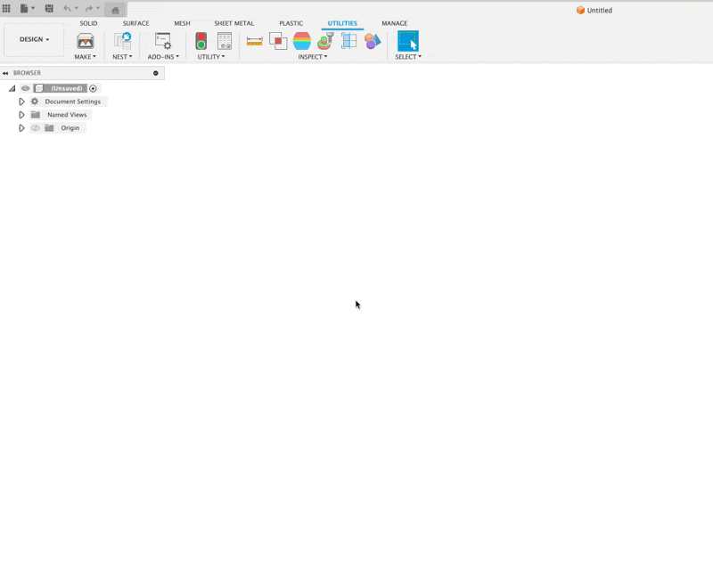
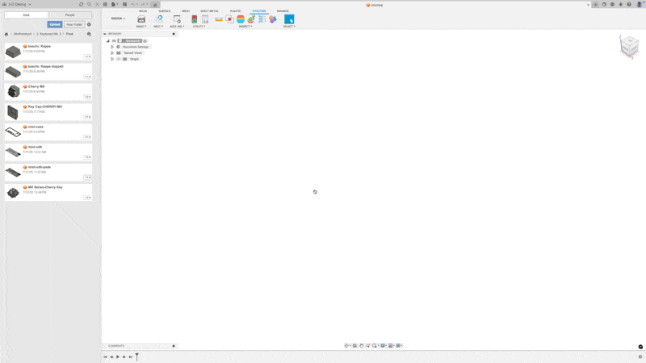

# KLE Switch Placer

A Fusion 360 Add-In that takes a [Keyboard Layout Editor (KLE)](http://www.keyboard-layout-editor.com/) JSON file and replicates a chosen 3D model (e.g., a switch or keycap) along the layout.

Ideal for keyboard designers looking to quickly populate a layout with 3D models directly in Fusion 360, this tool provides a simple UI to select a layout file, choose a model, and define custom spacing.

---

## ✨ Features

- ✅ File picker to import your KLE JSON layout  
- ✅ Select any existing component in your Fusion model to replicate  
- ✅ Set **custom horizontal and vertical spacing** in millimeters  
- ✅ Automatically places switches based on the layout's `x`, `y`, and `w`, `h` values  

---

## ⚠️ Known Limitations

- 🔄 **Rotated keys** (`r` and `rx`/`ry` in KLE) are not fully supported yet. They are placed roughly where expected, but their rotation origin may be off, especially for non-zero rotations. I'm still working on perfecting this logic.

---

## 📥 Installation

First, download this repository as a `zip` and extract it.

### MacOS

1. **Locate your Add-Ins folder**  
   Open Fusion 360 and go to:  
   `Tools > Add-Ins > Scripts and Add-Ins > Add-Ins tab > Open Add-Ins Folder`

2. **Copy the folder**  
   Drop the `kle_switch_placer` folder into the `AddIns` directory.

3. **Activate the Add-In**  
   In the **Scripts and Add-Ins** dialog, find `kle_switch_placer`, select it, and click **Run** and optionally **Run on Startup**.

---

### Windows

1. **Locate your Add-Ins folder**  
   Typically at:  
   `C:\Users\<YourUsername>\AppData\Roaming\Autodesk\Autodesk Fusion 360\API\AddIns`

2. **Copy the folder**  
   Paste the `kle_switch_placer` folder into that directory.

3. **Activate the Add-In**  
   In Fusion 360:  
   `Tools > Add-Ins > Scripts and Add-Ins > Add-Ins tab`  
   Select `kle_switch_placer`, then click **Run** and optionally **Run on Startup**.

---

## 🧰 Usage

1. Design or download a switch/keycap model in your Fusion file.  
   > Example: [Cherry MX Key & Keycap on GrabCAD](https://grabcad.com/library/cherry-mx-series-key-keycap-1)

2. Download your keyboard layout JSON from [KLE](http://www.keyboard-layout-editor.com/):  
   - Click the **Download** button and select `Download JSON`

3. Open Fusion 360, and activate the **KLE Switch Placer** Add-In.

4. Run the KLE Switch Placer AddIn
   - Go to the Utilities Tab
   - Click the Add-Ins Dropdown
   - Select `KLE Switch Placer` to start the Add-In

4. In the KLE Switch Placer dialog:  
   - Click to select your `layout.json` file  
   - Select the component you want to replicate (e.g., a keycap model)  
   - Enter your desired **horizontal** and **vertical spacing** in **millimeters**

5. Click **Place** and watch your layout come to life!
   

---

## 🙏 Credit & Inspiration

This Add-In was inspired by [misterkeebs/fusion360_scripts](https://github.com/misterkeebs/fusion360_scripts), which helped demonstrate how to work with KLE JSON layouts in Fusion. I built this version to add Fusion-native file selection and spacing configuration.

---

## 🧪 Contributing & Issues

Feel free to fork or open issues/PRs! If you’ve solved rotated key placement or have ideas to improve the tool, I’d love to collaborate.

